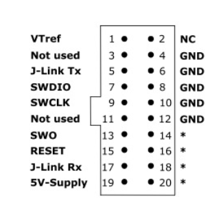
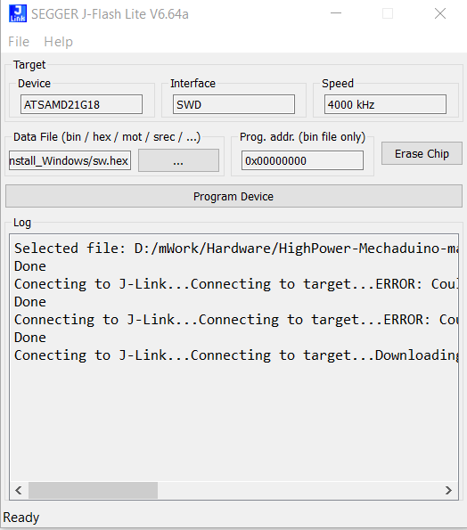

Có nhiều cách nạp bootloader bằng Opencd, phần mềm chính hãng, hoặc phần mêm của Jlink Flash

B1. **Cài đặt SEGGER J-FLASH lite**

B2. **Kết nối Jlink với ATSAM qua SWD**

Chỉ cần 3 chân SWD, SWCLK và GND

B3. **Chọn thông số arduino zero**

B4. Tải file HEX bootloader và chọn -> nạp
